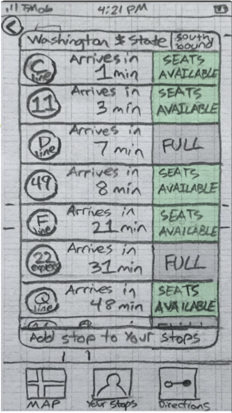
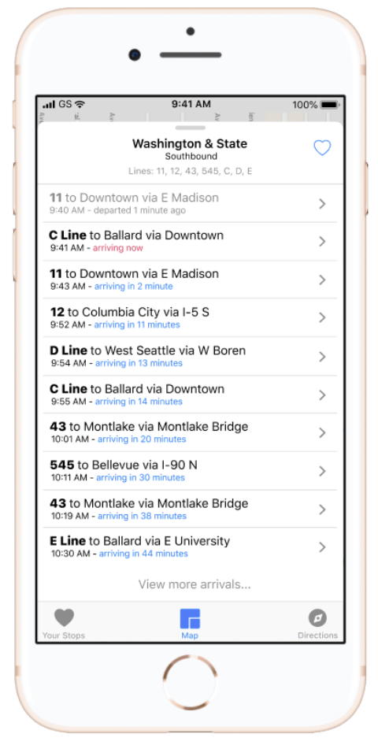
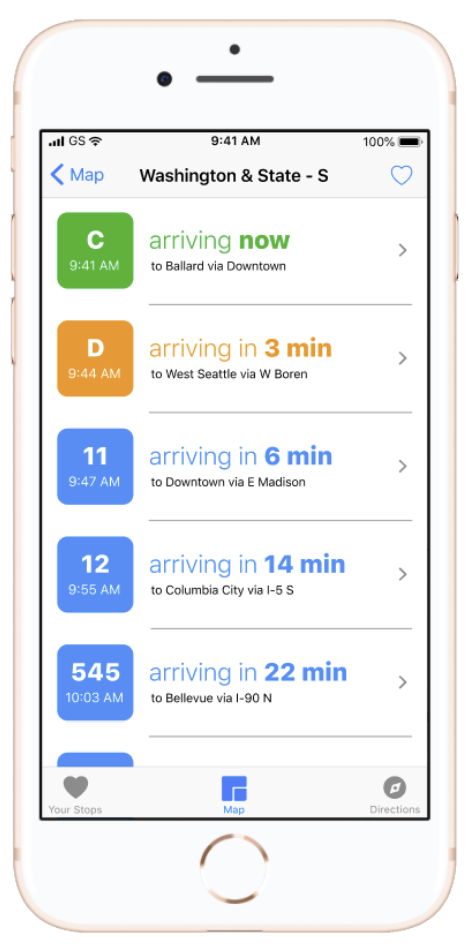
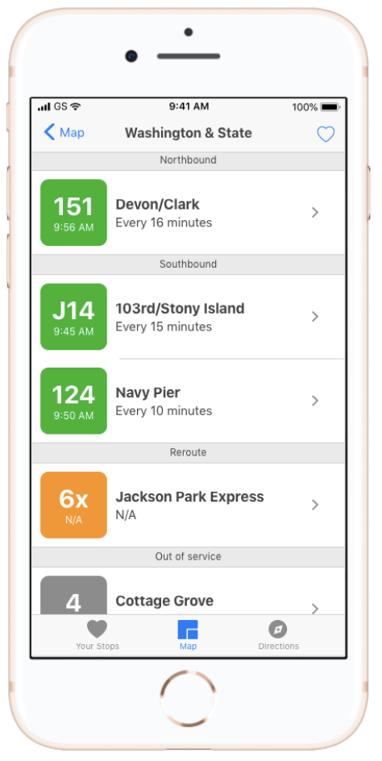

# BusyBus-Prototype

A prototype for the BusyBus app done in HTML and CSS.

### [Prototype](https://callanbeckberry.github.io/BusyBus-Prototype/)

### [Presenation Deck](https://docs.google.com/presentation/d/1zqXNBoCY7mIDC6gMbJlMczQ5kp2jCyKTmXUK6BO2U2s/edit?usp=sharing)

BusyBus is a transit app aiming to show users the busses arriving at their bus stop, and how long until busses arrive.

##### Early Drafts

##### High-Fidelity Mockup

##### Revised Mockup

##### Prototype Screenshot

